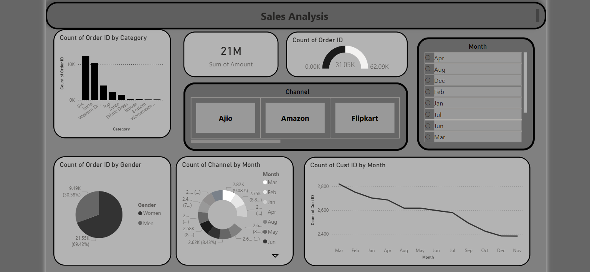

# store-data-analysis-powerbi
Power BI project for visualizing and analyzing sales data with key metrics and insights.

# Sales Analysis Dashboard - Power BI

## Overview
This project presents an interactive Sales Analysis Dashboard built using Power BI. It provides insights into sales performance, customer behavior, and product trends across different channels and time periods.

---

## Objectives
- Analyze total sales and order distribution
- Identify top-performing product categories
- Understand customer trends over time
- Compare sales across different e-commerce channels

---

## Dashboard Highlights

### Key Metrics
- Total Sales: 21M+
- Total Orders: 62K+
- Sales performance overview using KPI cards

---

### Visual Insights
- Orders by Category  
  Western and Ethnic categories contribute the most

- Orders by Gender  
  Women contribute approximately 69% of total orders

- Sales by Channel  
  Comparison between Ajio, Amazon, and Flipkart

- Monthly Trends  
  Customer count shows a gradual decline over months

- Orders Distribution by Month  
  Fairly balanced distribution with slight variations

---

## Tools and Technologies
- Power BI (Dashboard and Visualization)
- Data Cleaning and Transformation
- DAX (calculated measures)

---

---

## Dashboard Preview

---

## How to Use
1. Download the `.pbix` file  
2. Open it using Power BI Desktop  
3. Use filters (Month, Channel) to explore insights  

---

## Features
- Interactive filters (Month slicer)
- Channel-wise comparison (Ajio, Amazon, Flipkart)
- Clean and structured layout
- KPI indicators for quick insights

---

## Key Insights
- Women are the primary buyers (around 69%)
- Western category dominates sales
- Sales are distributed across multiple platforms
- Customer engagement slightly decreases over time

